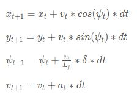

# CarND-Controls-MPC
This repository contains the project on implementation of a MPC Controller,
for controlling the motion of an autonomous car around a circular track simulated on
a simulator, as a part of Term 2 of Self Driving Car Nano degree by Udacity.

Model Predictive Controller (MPC) is used widely for path planning of autonomous
vehicles, which not only helps in navigating the vehicle in right direction but
also smoothen the vehicle motion accommodating number of parameters and their
influence in deciding the right steering of the vehicle. This is possible as one
can start with a simple motion model and then easily add new parameters to the
cost function. Also, being more sophisticated, MPC can also be used to model
different uncertainties and external environmental factors into the motion model of the system.

The code for the project is written in C++.

---

## Introduction
In MPC, an optimization problem is solved at every time step in order
to compute the optimal control sequence. Typically, only the first control is
implemented and in the next time step when new information about the state
is available a new control sequence is computed. So compared to PID controller, where
the error is provided by the system in action, all the errors are computed
during the course of the system and fed back to the system which is then taken into
consideration for deriving the control commands for the future time steps.

---

### MPC Controller Basics
MPC is a nonlinear system in which various parameters that influence the expeCTEd
control output is weighted onto producing a cost function, which is then constrained
to output the minimum most possible value. Cost function is the mathematical model
derived out of parameters, range of inputs, to the control model. These inputs
include any factors, both internal or external, that can influence the motion
control decision in our case.

For an autonomous car, some typical constraints that can be added as part of cost function include:
 * Cross track error (CTE): Distance of the vehicle position from the centre of the lane.
  This should be minimal.
 * EPSI error: Heading direction of the vehicle. this should be perpendicular to the lane.
 * Change in heading direction and change in speed due to quick acceleration/braking that can cause
   the vehicle to wiggle around the road.
 * Vehicle should maintain a good speed limit, not stop in the middle of the journey nor exceed speed limit.

These are a few of the constraints, each of which can be weighted and added to form a global
cost function, which then that MPC try to minimize and provide the actuation inputs to the vehicle based on these considerations.

## Project Details

### Goal
In the project, a MPC controller was used to drive an autonomous car around a circular track
with sharp left and right turns, by using the controller to derive actuation inputs, steering angle and throttle values. The major challenge is to make sure that the car drives smoothly following the centre of the lane as well as take smooth turns in the edges of turns. Also the car is expeCTEd to meet some velocity requirements like not stop on the way.

[Udacity's self driving car simulator](https://github.com/udacity/self-driving-car-sim/releases) for this was provided as a part of the course. Simulator provides the following measurements:

  * A list of waypoints, x and y coordinates of suggested trajectory points in the global map system.
   These points are from the position of the car to a few distance ahead of it.
  * The current position and heading of car in global map system.
  * The current steering angle and throttle applied to the car.
  * The current speed of the car.

Simulator provided values are received by the project code using the  [uWebSockets library](https://github.com/uNetworking/uWebSockets) library, we used as part of the project.

### Major Steps in the MPC based Implementation

1. **Get Input Data from simulator and manipulate them as needed**

  * Receive waypoints, position of car(px, py), heading angle (psi), steering angle (delta),
  velocity(v)and throttle value (a)
  * Convert way point coordinates to car coordinate system:
  Waypoint coordinates are obtained in global map system coordinates which is converted
  as relative position to car coordinate. This makes the car at origin and enables other computations
  easier having px, py values zero.
  * Convert velocity values from simulator m/s:
  simulator provides velocity in miles per hour where as the latency measurements are in seconds
  and positions in meter. So the conversion is done.

2. **Trajectory Planning**

  The coordinates from the waypoints are used to create a trajectory by deriving a polynomial of 3rd degree by fitting the discrete points to form a curve equation. This curve is displayed as the reference
  trajectory for the car as yellow lane in the simulator.

3. **Calculate cross track error(CTE) and heading angle error(EPSI):**

  * Calculate cross track error by the equation:
  <p align="center">
  
  </p>

  * Calculate heading angle error by the equation:
  <p align="center">
  
  </p>


4. **Taking Simulator Latency into Account:**

  Simulator reading is expeCTEd to have a latency between the actual reading the time taken to actually derive the actuator input from the MPC solver. This latency is estimated as 100 ms. Therefore, the simulator reading values are updated to the values after the latency period of 100 ms using the Kinematic Motion Model Equation as below.
  <p align="center">
  
  </p>

  State parameters are:

    1. The x coordinate of position of car in vehicle's coordinate system (x)
    2. The y coordinate of position of car in vehicle's coordinate system (y)
    3. The heading direction of car in vehicle's coordinate system (psi)
    4. The magnitude of velocity of car (v)

  Actuator inputs used to control the car are:

    1. The magnitude of steering angle (delta). This was limited to [-25, 25] as per the angle specification of simulator.
    2. The magnitude of throttle/acceleration (a). This was limited to [-1, 1] as per the throttle/brake specification of simulator.

  Latency or time difference, *dt* is taken as 100 ms.

** Note: MPC Solver kicks in from here **

5. **Define N(Time Step Length) and dt(Time Step Duration):**

  MPC solver is given the coefficients of the reference trajectory from the waypoints as calculated from step 2, and MPC tries to estimate the actuator inputs for current time step and a few steps later, as to derive actuator inputs to the car ahead of time. this is tuned with the help of two parameters, N and dt. N is the number of time steps and dt is the duration of each time step. A good value for the entire time period is found to be 2 seconds. I used dt=0.1 considering that as the simulator latency duration and used N to be 20 to obtain a time 7 and 0.01 etc and my observation was that with less time steps car was taking sharp turns and going off the track. With my solution, indeed the solver takes longer time but the motion is found to be really in control.


6. **Define Reference or Expectation values:**
  For deriving the cost functions of the system, some expeCTEd values for various motion parameters was used as below.

  * ExpeCTEd value of CTE is zero
  * ExpeCTEd value of EPSI is zero
  * Maximum speed of the car, which I have used is 40 mph. This value can go up to 100 mph for the simulator.


7. **Define Cost function constraints and their weights:**

  The major step in the MPC solver is to define the cost functions and determine the weights of each constraint for an optimal and desirable solution. MPC solver, implemented using [Ipopt]((https://projects.coin-or.org/Ipopt) and [Cppad]((https://www.coin-or.org/CppAD/) library generated actuator values while arriving at the minimal value of cost function.

  Cost function has constraints formed from:
  1. Cross track error, CTE and heading angle error, EPSI. This makes sure car stays in centre of line and in right direction.
  2. Initial values of acceleration and steering angle, which should help reduce jerk in sudden motion.
  3. Change in actuator inputs between time steps.
  4. Speed of the car.

  After a lot of trial and error experiments to understand how various constraints impact the motion, these are my conclusions. I found that maintaining a ratio across the different weight parameters help to derive a smooth motion.
  1. CTE and EPSI weights can be low values.
  2. Velocity weight same or little above the CTE and EPSI achieves the desired speed. That is a ratio of 1 to 1.5.
  3. To avoid overshooting the car in turns, increase the weights of change in actuator inputs in sequential runs.
  4. Weight values of initial actuator inputs, if very high slows down the car. On the other hand this weight value when raised brings the car to stable motion initially as well as keep the speed in control when approaching turns.

---
## Project Outcome

Final values tuned for my MPC solver as follows:

1. N = 20, dt = 0.1
2. Cost Function Weight for cte and epsi: 2
3. Cost Function Weight for velocity: 3
4. Cost Function Weight for change in actuation inputs: 200
5. Cost Function Weight for initial actuation inputs: 200000

Final Speed of the car achieved: 40 miles per hour

In order to raise the speed, my understand is that the time period of the MPC solver actuation and Latency effect of simulator needs to come in place. I plan to experiment this further as a follow up to the project. 

### Project Code and Build instructions
#### Dependencies

* cmake >= 3.5
 * All OSes: [click here for installation instructions](https://cmake.org/install/)
* make >= 4.1(mac, linux), 3.81(Windows)
  * Linux: make is installed by default on most Linux distros
  * Mac: [install Xcode command line tools to get make](https://developer.apple.com/xcode/features/)
  * Windows: [Click here for installation instructions](http://gnuwin32.sourceforge.net/packages/make.htm)
* gcc/g++ >= 5.4
  * Linux: gcc / g++ is installed by default on most Linux distros
  * Mac: same deal as make - [install Xcode command line tools]((https://developer.apple.com/xcode/features/)
  * Windows: recommend using [MinGW](http://www.mingw.org/)
* [uWebSockets](https://github.com/uWebSockets/uWebSockets)
  * Run either `install-mac.sh` or `install-ubuntu.sh`.
  * If you install from source, checkout to commit `e94b6e1`, i.e.
    ```
    git clone https://github.com/uWebSockets/uWebSockets
    cd uWebSockets
    git checkout e94b6e1
    ```
    Some function signatures have changed in v0.14.x. See [this PR](https://github.com/udacity/CarND-MPC-Project/pull/3) for more details.

* **Ipopt and CppAD:** Please refer to [this document](https://github.com/udacity/CarND-MPC-Project/blob/master/install_Ipopt_CppAD.md) for installation instructions.
* [Eigen](http://eigen.tuxfamily.org/index.php?title=Main_Page). This is already part of the repo so you shouldn't have to worry about it.
* Simulator. You can download these from the [releases tab](https://github.com/udacity/self-driving-car-sim/releases).
* Not a dependency but read the [DATA.md](./DATA.md) for a description of the data sent back from the simulator.


### Basic Build Instructions

1. Clone this repo.
2. Make a build directory: `mkdir build && cd build`
3. Compile: `cmake .. && make`
4. Run it: `./mpc`.

## Tips

1. It's recommended to test the MPC on basic examples to see if your implementation behaves as desired. One possible example
is the vehicle starting offset of a straight line (reference). If the MPC implementation is correct, after some number of timesteps
(not too many) it should find and track the reference line.
2. The `lake_track_waypoints.csv` file has the waypoints of the lake track. You could use this to fit polynomials and points and see of how well your model tracks curve. NOTE: This file might be not completely in sync with the simulator so your solution should NOT depend on it.
3. For visualization this C++ [matplotlib wrapper](https://github.com/lava/matplotlib-cpp) could be helpful.)
4.  Tips for setting up your environment are available [here](https://classroom.udacity.com/nanodegrees/nd013/parts/40f38239-66b6-46ec-ae68-03afd8a601c8/modules/0949fca6-b379-42af-a919-ee50aa304e6a/lessons/f758c44c-5e40-4e01-93b5-1a82aa4e044f/concepts/23d376c7-0195-4276-bdf0-e02f1f3c665d)
5. **VM Latency:** Some students have reported differences in behavior using VM's ostensibly a result of latency.  Please let us know if issues arise as a result of a VM environment.
